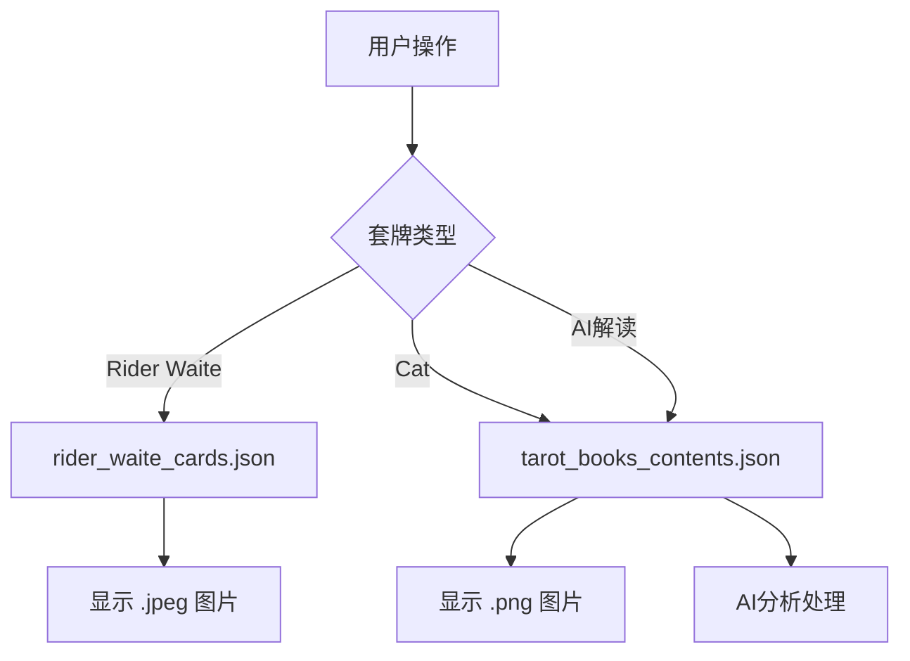

# 📊 塔罗牌应用数据文件使用总结

## ✅ 迁移完成 - 统一数据源

### 🎯 **当前数据架构**（2024年更新）

已成功将所有数据源统一为 `tarot_books_contents.json`，不再维护 `tarot_books_processed_clean.json`。

---

## 📁 **当前使用的JSON文件**

### **1. 主要数据文件**

#### 📄 `assets/data/tarot_books_contents.json`
- **用途**：**统一数据源** - 所有塔罗牌文本数据
- **服务对象**：
  - ✅ Cat套牌数据
  - ✅ AI后端RAG系统
  - ✅ 牌意story和meaning
  - ✅ Spreads说明
- **图片格式**：动态（根据套牌配置）

#### 📄 `assets/data/rider_waite_cards.json`
- **用途**：Rider Waite套牌专用数据
- **特点**：文件名使用 `.jpeg` 扩展名
- **状态**：继续使用

#### 📄 `assets/data/tarot_decks_example.json`
- **用途**：套牌配置主文件
- **更新**：Cat套牌指向 `tarot_books_contents.json`

---

### **2. 已创建但未启用的文件**

#### 📄 `assets/data/unified_tarot_data.json`
- **用途**：未来统一架构设计
- **状态**：已设计完成，待迁移

#### 📄 `assets/data/tarot_decks_unified.json`
- **用途**：统一套牌配置
- **状态**：已设计完成，待迁移

---

### **3. 已废弃的文件**

#### ❌ `assets/data/tarot_books_processed_clean.json`
- **状态**：**已废弃，不再维护**
- **原因**：与 `tarot_books_contents.json` 内容重复
- **迁移**：所有引用已切换到 `tarot_books_contents.json`

---

## 🔄 **完成的迁移工作**

### **代码文件更新**
- ✅ `lib/services/local_data_service.dart`
- ✅ `lib/ai_models/examples/usage_examples.dart`
- ✅ `assets/data/tarot_decks_example.json`
- ✅ `scripts/merge_tarot_data.py`

### **数据流程优化**


---

## 📊 **当前数据架构特点**

### **优点** ✅
- **统一数据源**：避免重复维护
- **格式兼容**：支持不同图片格式
- **AI集成**：单一数据源支持所有AI功能
- **维护简化**：减少数据文件数量

### **架构清晰** 📋
- **前端应用**：根据套牌动态选择数据文件
- **AI后端**：统一使用 `tarot_books_contents.json`
- **图片管理**：根据套牌配置自动选择格式

---

## 🚀 **未来扩展建议**

### **添加新套牌的步骤**
1. **准备图片文件**
   ```
   assets/images/tarot/new_deck/
   ├── back.png (或其他格式)
   ├── major_00_fool.png
   └── ...
   ```

2. **更新套牌配置**
   ```json
   // 在 tarot_decks_example.json 中添加
   {
     "deck_id": "new_deck",
     "card_data_file": "tarot_books_contents.json",
     "back_image": "back.png"
   }
   ```

3. **完成** - 自动继承所有文本数据 ✨

### **可选：迁移到完全统一架构**
- 使用 `unified_tarot_data.json`
- 启用 `UnifiedDataService`
- 进一步简化数据管理

---

## 📝 **文件状态总结**

| 文件名 | 状态 | 用途 | 维护 |
|--------|------|------|------|
| `tarot_books_contents.json` | ✅ **主要** | 统一数据源 | 继续 |
| `rider_waite_cards.json` | ✅ 使用中 | Rider Waite专用 | 继续 |
| `tarot_decks_example.json` | ✅ 使用中 | 套牌配置 | 继续 |
| `unified_tarot_data.json` | 🔄 待用 | 未来架构 | 可选 |
| `tarot_books_processed_clean.json` | ❌ **废弃** | 已迁移 | 停止 |

---

## ✨ **总结**

通过这次迁移，我们：
- 🎯 **统一了数据源**，使用 `tarot_books_contents.json` 作为主要数据文件
- 🔧 **简化了维护**，不再需要同步两个相似的文件  
- 🚀 **优化了架构**，为未来扩展打下基础
- ✅ **保持了功能**，所有现有功能继续正常工作

应用现在使用更清晰、更易维护的数据架构！
